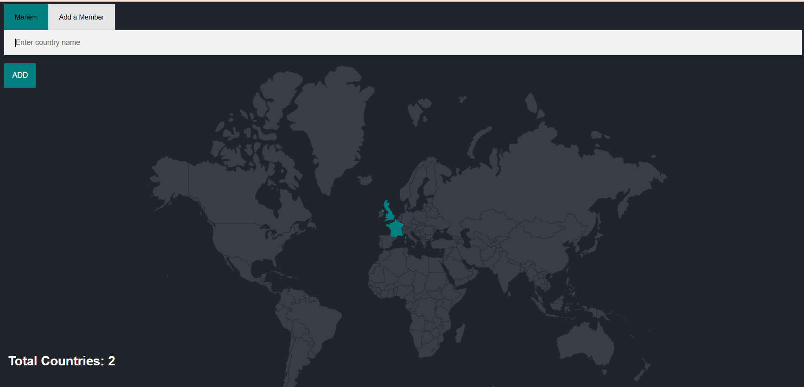

# World Visits Map 🌍

Ce projet affiche une carte du monde avec les pays visités par différents utilisateurs.

## Utilisation
- Ouvrir le fichier `index.html` dans un navigateur.
- La carte affiche les pays visités, colorés selon chaque utilisateur.

## Fichier SQL
Toutes les requêtes de création et d’insertion sont dans `queries.sql`.

